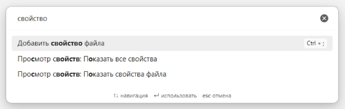
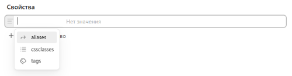
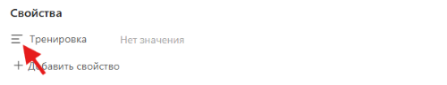
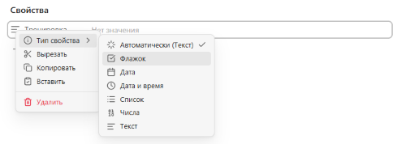
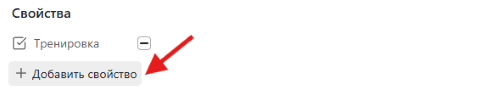
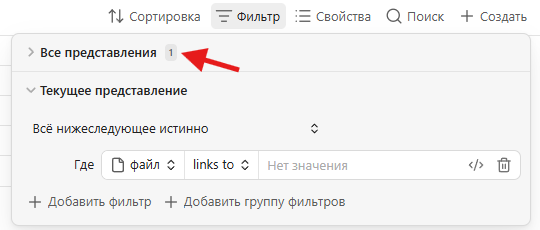
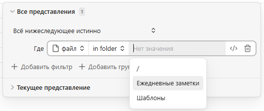
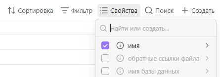
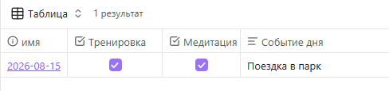
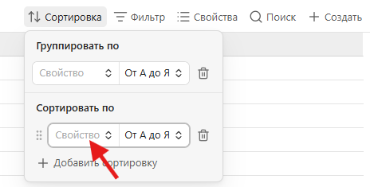

# Как настроить ведение ежедневных заметок в Obsidian без сторонних плагинов

## Обзор

Эта инструкция поможет настроить систему ведения ежедневных заметок в Obsidian с помощью встроенных функций приложения. 
Такую систему можно использовать для планирования, управления задачами, отслеживания привычек, ведения дневника и записи идей.

> [!NOTE]
> В Obsidian есть разные способы организации ежедневных заметок. Предложенный в этой инструкции вариант — один из самых оптимальных по соотношению пользы и сложности настройки.

## Перед началом

Перед тем как приступить к настройке, вам понадобятся:

- установленный Obsidian версии 1.9.0 или новее;
- созданное хранилище;
- базовые навыки работы с заметками;
- включенные **Ежедневные заметки** и **Базы данных** в разделе **Встроенные плагины** ![Встроенные плагины][built-in-icon] в настройках Obsidian (по умолчанию включены).

Подробнее об установке Obsidian и работе с хранилищами и заметками см. [Помощь по Obsidian][obsidian-help].

## Настройка шаблона ежедневной заметки

Чтобы не продумывать каждый раз содержание новой ежедневной заметки, используйте шаблон.

1. Создайте новую заметку и назовите ее «Шаблон ежедневной заметки».

2. Добавьте свойства в заметку.

    Свойства — это дополнительные данные о заметке. В них можно указывать информацию, которую вы хотите отслеживать: привычки, настроение, идеи.

    2.1. Откройте палитру команд с помощью клавиш **Ctrl+P** (или **Cmd+P** на macOS) и напишите в поле поиска «Свойство». 

    

    2.2. Выберите «Добавить свойство файла».

    Под заголовком заметки появится панель со свойствами.

    

    > **Если не получилось.**
    > Если под заголовком заметки не появилась панель со свойствами, зайдите в **Настройки ![Настройки][settings-icon] → Редактор**, найдите настройку **Свойства в документе** и выберите значение **Видимый**.

    2.3. Впишите название свойства: например, «Тренировка». Нажмите **Enter**.

    

    2.4. Нажмите на кнопку с тремя полосками ![Выбор типа][property-type-icon] рядом с названием свойства. 

    

    2.5. В раскрывшемся списке откройте **Тип свойства**. Выберите тип из предложенных вариантов: например, **Флажок**.

     

    > **Совет.**
    > Используйте **Флажок**, чтобы отслеживать привычки, **Текст**, чтобы отслеживать идеи и мысли, и **Список**, чтобы отслеживать настроение.

    2.6. Добавьте новые свойства с помощью кнопки **Добавить свойство** на панели.

    

3. Создайте в теле заметки текст шаблона, например:

    ```markdown
    ## Задачи

    - [ ] 

    ## Заметки


    ## Итоги дня
    ```

    > **Совет.**
    > Не создавайте сразу сложный шаблон. Для начала достаточно пары разделов. По мере ведения дневника вы можете редактировать шаблон по своему усмотрению.

## Настройка ежедневных заметок

Чтобы заметки создавались по шаблону и сохранялись в нужном месте, настройте плагин **Ежедневные заметки**.

1. Создайте папку, в которой будете хранить ежедневные заметки.

2. Откройте **Настройки** ![Настройки][settings-icon] и в списке **Встроенные плагины** выберите **Ежедневные заметки** ![Ежедневные заметки][daily-note-icon].

    > **Если не получилось.**
    > Если вы не видите пункта **Ежедневные заметки**, убедитесь, что в настройках включен этот плагин (см. [Перед началом](#перед-началом)).

3. В поле **Формат даты** выберите формат или оставьте вариант по умолчанию.

    Этот шаг задает формат названия ежедневной заметки. Например, заметка с форматом даты `ГГГГ-ММ-ДД` будет называться «2026-08-15».

4. В поле **Расположение нового файла** выберите папку для хранения ежедневных заметок.

    > **Дополнительно.**
    > Все ежедневные заметки будут автоматически сохраняться в этой папке. Чтобы сохранять ежедневные заметки в подпапках, например, по годам и месяцам, используйте поле **Пользовательский формат**. <br />
    > Подробнее см. [Помощь по Obsidian — Ежедневные заметки][obsidian-help-daily-notes].

5. В поле **Расположение шаблона** выберите путь к вашему шаблону ежедневной заметки.

## Создание ежедневной заметки

1. Нажмите **Сегодняшняя заметка** ![Ежедневные заметки][daily-note-icon] на вертикальной панели Obsidian. 

    Откроется заметка с датой в названии и вашим шаблоном ежедневной заметки.

    > **Если не получилось.**
    > Если вы не видите иконку ![Ежедневные заметки][daily-note-icon] на вертикальной панели, убедитесь, что в настройках включен плагин **Ежедневные заметки** (см. [Перед началом](#перед-началом)).

2. Заполните свойства или запишите что-нибудь в свою сегодняшнюю заметку. 

    > **Дополнительно.**
    > Если вы закроете сегодняшнюю заметку, ее всегда можно открыть той же кнопкой ![Ежедневные заметки][daily-note-icon] на вертикальной панели. На следующий день эта кнопка уже откроет новую ежедневную заметку.

3. Добавьте теги. Для этого введите в любом месте заметки `#` и ключевое слово: например `#работа` — если в вашей заметке есть записи по работе.

    С помощью тегов вы сможете фильтровать заметки по темам и проектам.

4. Свяжите ежедневную заметку с другими вашими заметками с помощью ссылок. Для этого введите `[[`, выберите заметку из списка или введите название внутри квадратных скобок: например, `[[Ремонт]]` — если в вашей ежедневной заметке есть задачи по ремонту.

    Ссылки помогут вам увидеть, по каким заметкам у вас есть записи в ежедневных заметках: в **Локальном графе** или в **Упоминаниях со ссылкой** внизу заметок.

## Создание базы ежедневных заметок

Чтобы удобно просматривать ежедневные заметки, фильтровать их и отслеживать привычки, создайте базу.

1. Нажмите **Создать новую базу** ![База][base-icon] на вертикальной панели Obsidian.

    Откроется база со всеми заметками вашего хранилища.

    > **Если не получилось.**
    > Если вы не видите иконку ![База][base-icon] на вертикальной панели, убедитесь, что в настройках включен плагин **Базы данных** (см. [Перед началом](#перед-началом)).

2. Назовите базу — например, «Мои ежедневные заметки».

3. Добавьте фильтр для отображения только ежедневных заметок.

    3.1. На панели в верхней части базы нажмите **Фильтр** ![Фильтр][filter-icon] и выберите **Все представления**.

    

    3.2. В поле фильтра оставьте свойство **File** (Файл), поставьте условие **in folder**, а в третьем поле выберите папку с ежедневными заметками.

    

    Теперь в базе отображаются только ежедневные заметки.

4. Добавьте заданные в шаблоне свойства, которые вы хотите отслеживать и просматривать на общей странице базы ежедневных заметок.

    4.1. На панели в верхней части базы нажмите **Свойства** ![Свойства][properties-icon].

    

    4.2. Поставьте галочки напротив тех свойств, которые вы хотите видеть на странице базы — например, `Тренировка`, `Медитация`, `Событие дня`.

    Выбранные свойства теперь будут отображаться в базе.

    

    > **Дополнительно.**
    > Вы также можете выбрать для отображения системные свойства — например, теги или ссылки на файлы.

5. Добавьте сортировку по дате.

    5.1. На панели в верхней части базы нажмите **Сортировка** ![Сортировка][sort-icon].

    5.2. Нажмите на **Свойства** под заголовком **Сортировать по**. 

    

    5.3. В списке свойств выберите **Дата создания** ![Дата][date-icon], а в поле рядом — вариант сортировки **От нового к старому**, чтобы последняя ежедневная заметка всегда была наверху.

6. Добавьте дополнительный фильтр, если хотите видеть ежедневные заметки только за определенный период.

    6.1. Выберите **Фильтр** ![Фильтр][filter-icon] → **Текущее представление**.

    6.2. В поле фильтра установите свойство **Date** (Дата), поставьте условие **on or after** и выберите дату, начиная с которой нужно отображать заметки: например, «01.08.2026».

    6.3. Добавьте второе условие фильтра: нажмите **Добавить фильтр** ![Добавить фильтр][add-icon], выберите свойство **Date** (Дата), условие **on or before** и дату окончания периода. Например, «31.08.2026», чтобы вместе с условием из шага 6.2 фильтр показывал заметки только за август.

> **Дополнительно.**
> Вы можете создать дополнительные **Представления** ![Представление][view-icon] с другими фильтрами и сортировкой — например, для заметок за квартал или год. Подробнее см. [Помощь по Obsidian — Виды баз][obsidian-help-bases-views].

Теперь у вас есть рабочая система ежедневных заметок: шаблон, настроенный плагин и база для просмотра и отслеживания.

## См. также

* [Помощь по Obsidian][obsidian-help]
* [Mastering Obsidian Daily Notes][daily-notes-guide]

[built-in-icon]: img/built-in-plugins-icon.png
[settings-icon]: img/settings-icon.png
[property-type-icon]: img/property-type-icon.png
[daily-note-icon]: img/daily-note-icon.png
[base-icon]: img/base-icon.png
[filter-icon]: img/filter-icon.png
[properties-icon]: img/properties-icon.png
[sort-icon]: img/sort-icon.png
[date-icon]: img/date-icon.png
[view-icon]: img/view-icon.png
[add-icon]: img/add-icon.png
[obsidian-help]: https://obsidian.md/ru/help
[obsidian-help-daily-notes]: https://obsidian.md/ru/help/plugins/daily-notes
[obsidian-help-bases-views]: https://obsidian.md/ru/help/bases/views
[daily-notes-guide]: https://www.obsibrain.com/blog/mastering-obsidian-daily-notes-a-complete-guide 