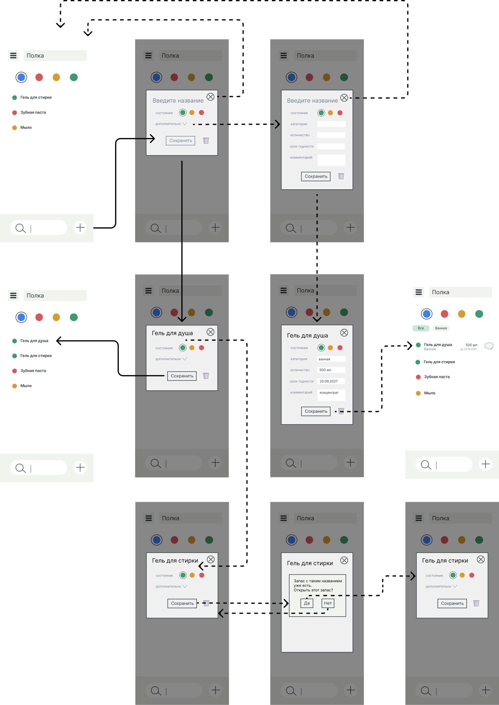
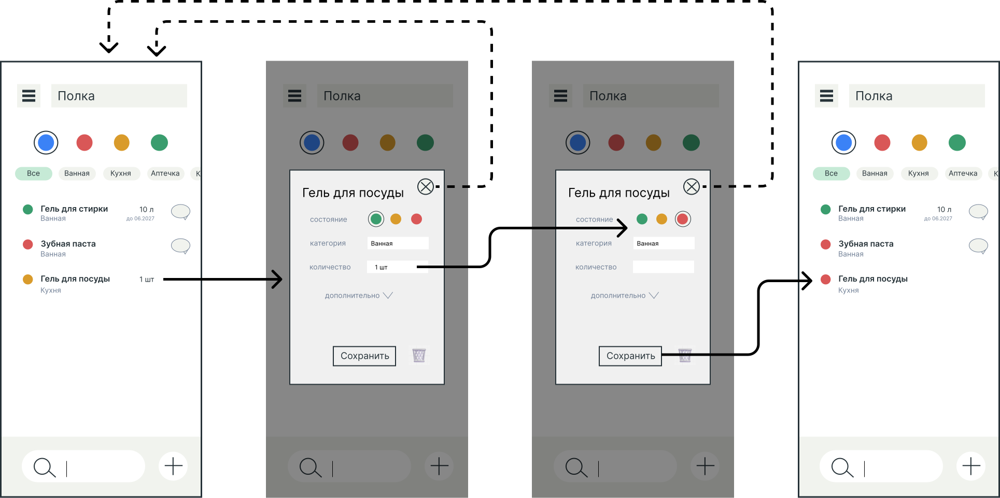
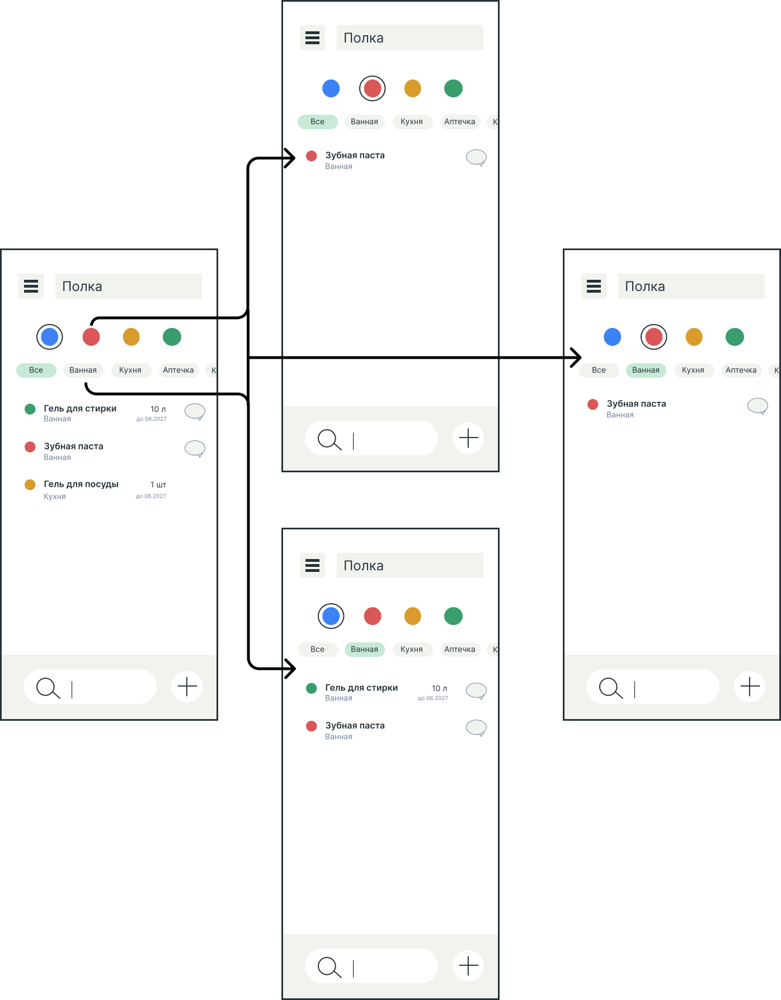
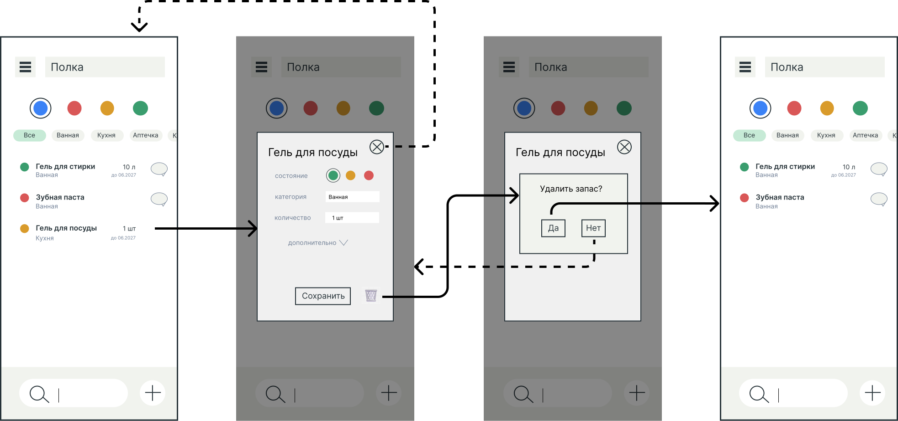
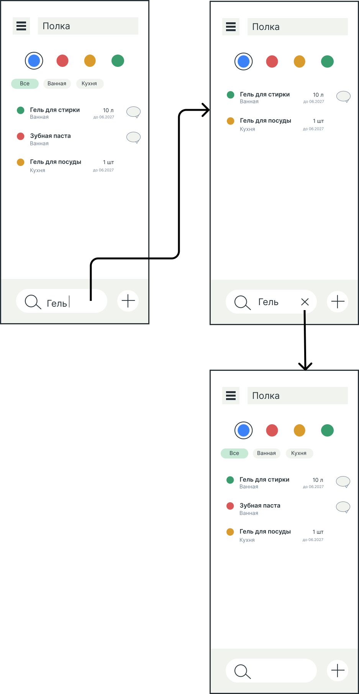

# Полка. Функциональная спецификация

## Назначение документа

Этот документ описывает функциональность приложения и пользовательские сценарии. Документ строится на основе [брифа](01-product-brief.md) и [глоссария](02-glossary.md).

## Функциональные требования

###  Создание запаса

Пользователь должен иметь возможность создать новый [запас](02-glossary.md), указав название и [состояние](02-glossary.md). Система должна сохранить запас и отобразить его в списке запасов.

### Просмотр и редактирование запаса

Пользователь должен иметь возможность посмотреть запас и изменить название, состояние и значения в [дополнительных полях](02-glossary.md) существующего запаса. Система должна сохранить изменения и отобразить их в списке запасов.

### Просмотр всех запасов

Система должна отображать список всех запасов пользователя. Для каждого запаса система должна показывать название, состояние и заполненные дополнительные поля.

### Добавление дополнительных полей

Пользователь должен иметь возможность добавить к запасу дополнительные поля из предложенного списка: [категорию](02-glossary.md), количество, срок годности, комментарий. Система должна сохранить значения этих полей и отобразить их в списке запасов.

### Фильтрация

Пользователь должен иметь возможность отфильтровать список запасов по состоянию, категории или состоянию и категории одновременно. Система должна отображать только запасы с выбранным фильтром и позволять сбросить фильтр.

### Удаление запаса

Пользователь должен иметь возможность безвозвратно удалить существующий запас. Система должна запросить подтверждение, удалить данные о запасе и не отображать его в списке запасов.

### Поиск по названию

Пользователь должен иметь возможность найти запас по названию. Система должна искать среди всех запасов независимо от выбранных фильтров и отображать найденные запасы.

## Пользовательские сценарии

### Создание запаса

### Просмотр и редактирование запаса

### Просмотр и фильтрация всех запасов

### Удаление запаса

### Поиск по названию запаса

