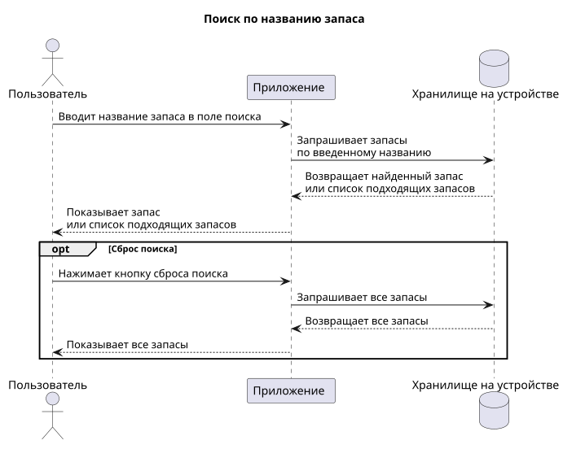
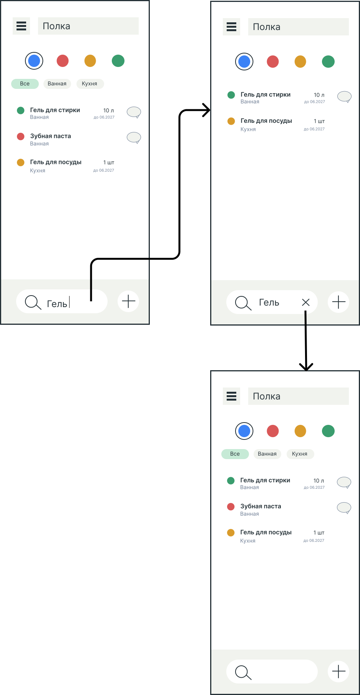

# Пользовательский сценарий поиска по названию запаса

## Описание сценария

### Действующие лица

1. Пользователь
2. Приложение

### Предварительные условия

Пользователь находится на главном экране со списком запасов.

### Выходные условия

Список запасов отфильтрован по введённому названию.

### Основной сценарий

1. Пользователь вводит в поле поиска название запаса.
2. Приложение показывает запас с введенным названием или список подходящих запасов.

### Альтернативный сценарий

**Сброс поиска**

1. Пользователь вводит в поле поиска название запаса.
2. Приложение показывает запас с введенным названием или список подходящих запасов.
3. Пользователь нажимает кнопку сброса поиска.
4. Приложение показывает все запасы.

## Диаграмма последовательности

## Прототипы экранов

