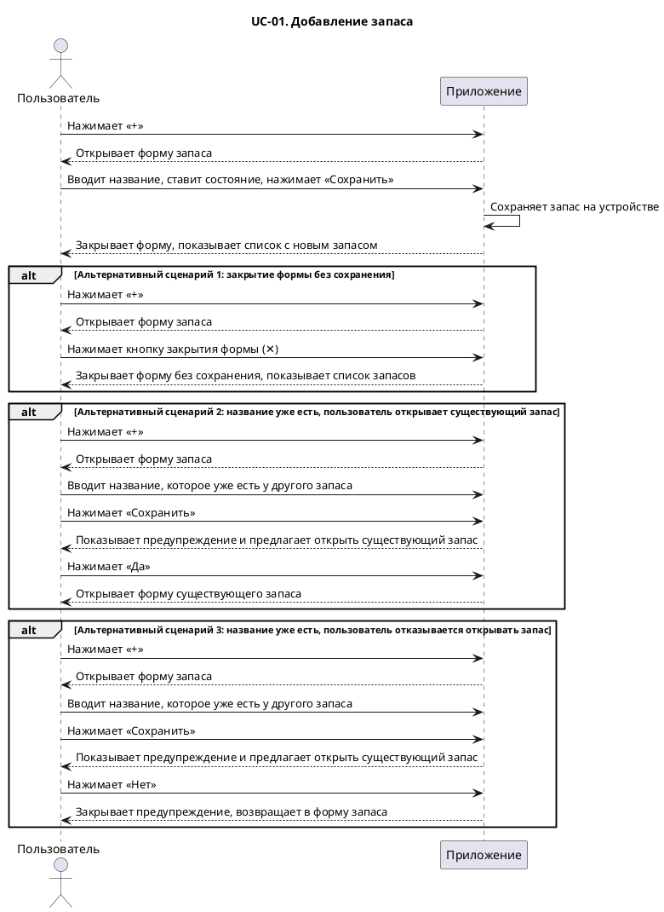

# Пользовательский сценарий создания запаса

## Пользовательский сценарий

### Действующие лица

1. Пользователь
2. Приложение

### Предварительные условия

Пользователь находится на главном экране со списком запасов.

### Выходные условия

В приложении появился новый запас.

### Основной сценарий

1. Пользователь нажимает кнопку «+».
2. Приложение открывает форму запаса.
3. Пользователь вводит название запаса и при необходимости меняет состояние.
4. Пользователь нажимает кнопку «Сохранить».
5. Приложение сохраняет запас на устройстве.
6. Приложение закрывает форму и показывает список запасов с новым запасом.

### Альтернативные сценарии

**Закрытие формы без сохранения**

1. Пользователь нажимает кнопку «+».
2. Приложение открывает форму запаса.
4. Пользователь нажимает кнопку закрытия формы (✕).
5. Приложение закрывает форму без сохранения и показывает список запасов.

**Запас с таким названием уже есть, пользователь открывает его**

1. Пользователь нажимает кнопку «+».
2. Приложение открывает форму запаса.
3. Пользователь вводит название, которое уже есть у другого запаса.
4. Пользователь нажимает кнопку «Сохранить».
5. Приложение показывает предупреждение, что запас с таким названием уже есть, и предлагает его открыть.
6. Пользователь нажимает «Да».
7. Приложение открывает форму существующего запаса.

**Запас с таким названием уже есть, пользователь отказывается его открывать**

1. Пользователь нажимает кнопку «+».
2. Приложение открывает форму запаса.
3. Пользователь вводит название, которое уже есть у другого запаса.
4. Пользователь нажимает кнопку «Сохранить».
5. Приложение показывает предупреждение, что запас с таким названием уже есть, и предлагает его открыть.
6. Пользователь нажимает «Нет».
7. Приложение закрывает предупреждение и возвращает пользователя в форму запаса.

## Диаграмма

## Прототипы экранов

