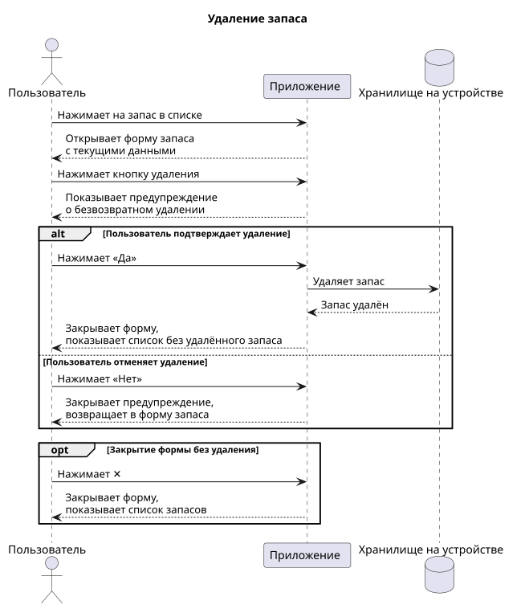
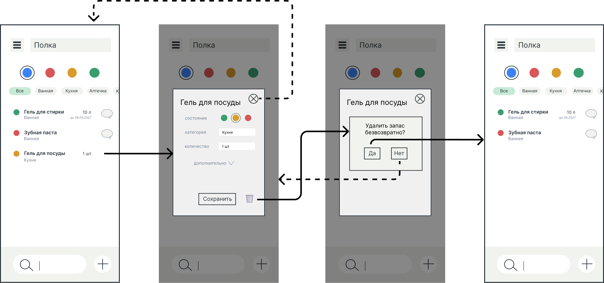

# Пользовательский сценарий удаления запаса

## Описание сценария

### Действующие лица

1. Пользователь
2. Приложение

### Предварительные условия

Пользователь находится на главном экране со списком запасов. В приложении есть хотя бы один запас.

### Выходные условия

Запас удален и не отображается в списке запасов.

### Основной сценарий

1. Пользователь нажимает на запас в списке.
2. Приложение открывает форму запаса с текущими данными.
3. Пользователь нажимает кнопку удаления.
4. Приложение показывает предупреждение о безвозвратном удалении и просит подтвердить действие.
5. Пользователь нажимает «Да».
6. Приложение удаляет запас с устройства.
7. Приложение закрывает форму и показывает список запасов без удаленного запаса.

### Альтернативные сценарии

**Отказ от удаления**

1. Пользователь нажимает на запас в списке.
2. Приложение открывает форму запаса с текущими данными.
3. Пользователь нажимает кнопку удаления.
4. Приложение показывает предупреждение о безвозвратном удалении и просит подтвердить действие.
5. Пользователь нажимает «Нет».
6. Приложение закрывает предупреждение и возвращает пользователя в форму запаса.

**Закрытие формы без удаления**

1. Пользователь нажимает на запас в списке.
2. Приложение открывает форму запаса с текущими данными.
3. Пользователь нажимает кнопку закрытия формы (✕).
4. Приложение закрывает форму и показывает список запасов.

## Диаграмма последовательности

## Прототипы экранов

