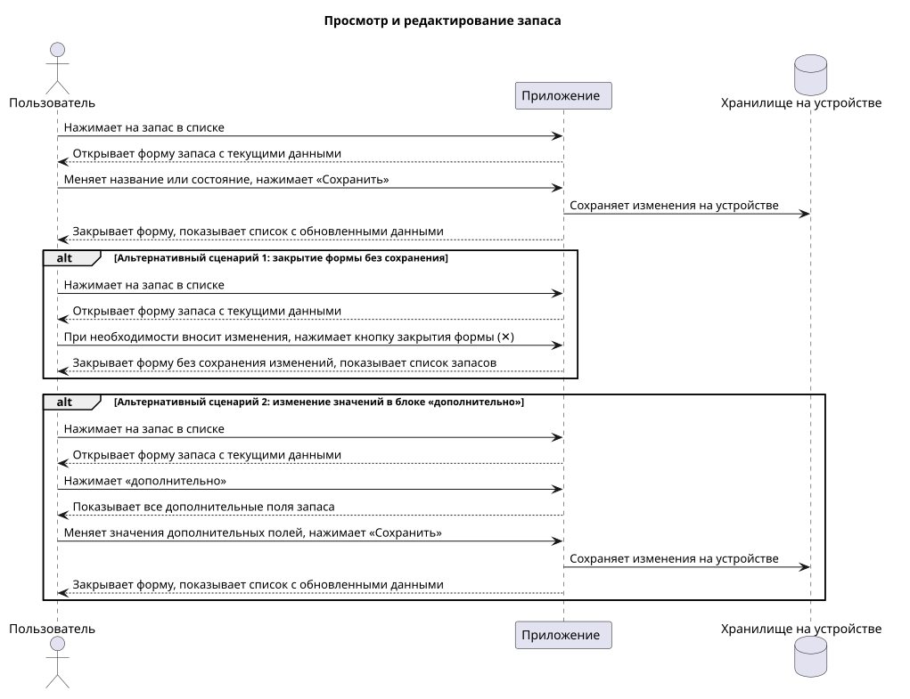

# Пользовательский сценарий просмотра и редактирования запаса

## Описание сценария
 
### Действующие лица
 
1. Пользователь
2. Приложение

### Предварительные условия
 
Пользователь находится на главном экране со списком запасов. В списке есть хотя бы один запас.
 
### Выходные условия
 
Изменения запаса сохранены и отображаются в списке запасов.
 
### Основной сценарий
 
1. Пользователь нажимает на запас в списке.
2. Приложение открывает форму запаса с текущими данными.
3. Пользователь меняет название или состояние.
4. Пользователь нажимает кнопку «Сохранить».
5. Приложение сохраняет изменения на устройстве.
6. Приложение закрывает форму и показывает список запасов с обновленными данными.

### Альтернативные сценарии
 
**Закрытие формы без сохранения**
 
1. Пользователь нажимает на запас в списке.
2. Приложение открывает форму запаса с текущими данными.
3. Пользователь при необходимости вносит изменения.
4. Пользователь нажимает кнопку закрытия формы (✕).
5. Приложение закрывает форму без сохранения изменений и показывает список запасов.

**Изменение значений в блоке «дополнительно»**
 
1. Пользователь нажимает на запас в списке.
2. Приложение открывает форму запаса с текущими данными.
3. Пользователь нажимает «дополнительно».
4. Приложение показывает все дополнительные поля запаса.
5. Пользователь меняет значения дополнительных полей.
6. Пользователь нажимает кнопку «Сохранить».
7. Приложение сохраняет изменения на устройстве.
8. Приложение закрывает форму и показывает список запасов с обновленными данными.

## Диаграмма последовательности
 

 
## Прототипы экранов
 

