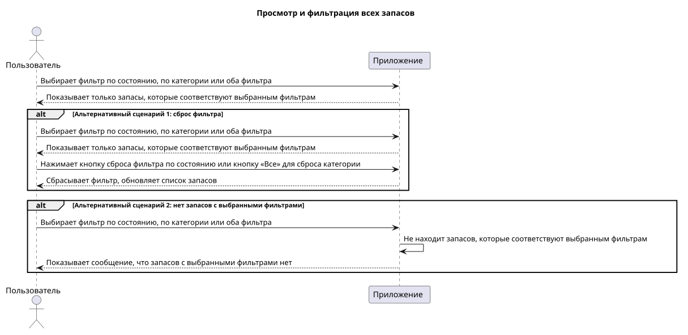
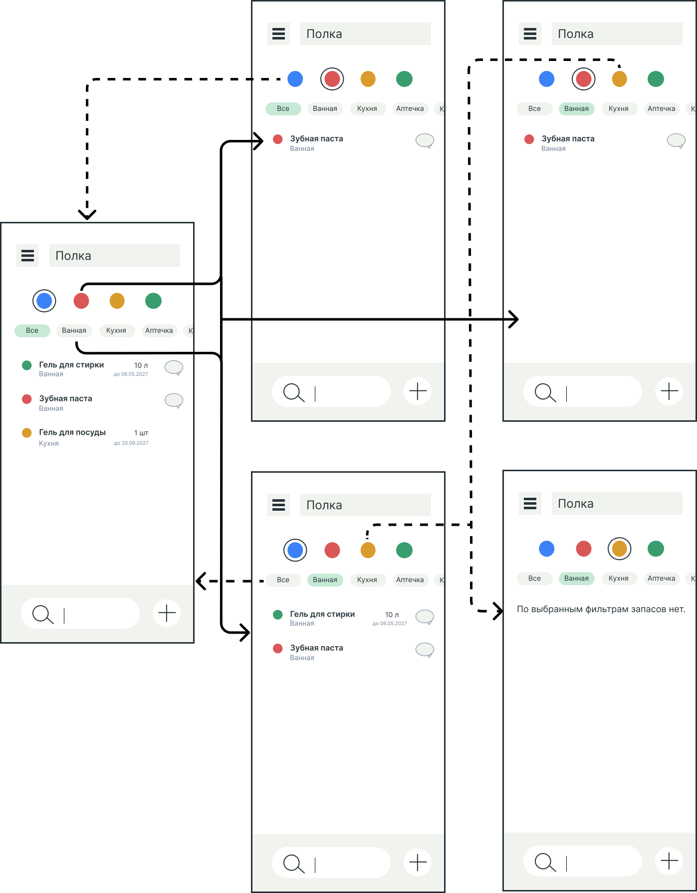

# Пользовательский сценарий просмотра и фильтрации всех запасов

## Описание сценария

### Действующие лица

1. Пользователь
2. Приложение

### Предварительные условия

Пользователь находится на главном экране со списком запасов. В приложении есть хотя бы один запас. Фильтры не выбраны.

### Выходные условия

Приложение показывает список запасов, соответствующий выбранным фильтрам.

### Основной сценарий
 
1. Пользователь выбирает фильтр по состоянию, по категории или оба фильтра.
2. Приложение показывает только запасы, которые соответствуют выбранным фильтрам.

### Альтернативные сценарии

**Сброс фильтра**
 
1. Пользователь выбирает фильтр по состоянию, по категории или оба фильтра.
2. Приложение показывает только запасы, которые соответствуют выбранным фильтрам.
3. Пользователь нажимает кнопку сброса фильтра по состоянию, чтобы сбросить фильтр по состоянию, или кнопку «Все», чтобы сбросить фильтр по категории.
4. Приложение сбрасывает фильтр и обновляет список запасов.

**Нет запасов с выбранными фильтрами**
 
1. Пользователь выбирает фильтр по состоянию, по категории или оба фильтра.
2. Приложение не находит запасов, которые соответствуют выбранным фильтрам.
3. Приложение показывает сообщение, что запасов с выбранными фильтрами нет.

## Диаграмма последовательности

## Прототипы экранов

